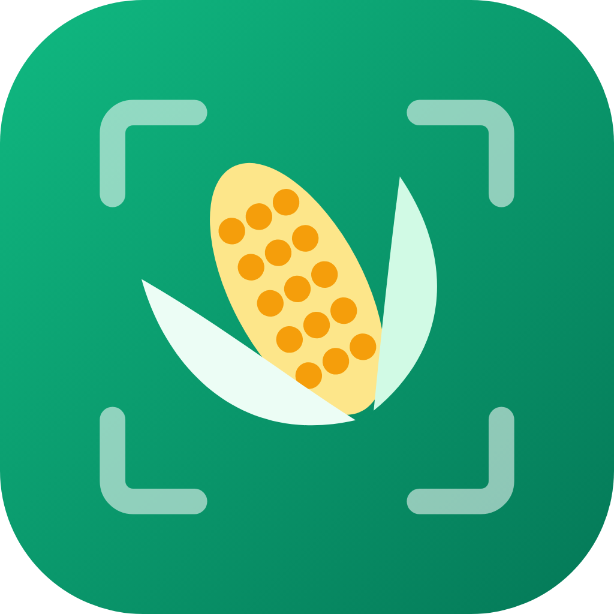

<p align="center">
  
</p>

<h1 align="center">Umlimi</h1>
<p align="center"><b>Offline maize AI for South African smallholder farmers</b><br>
Hack-Nation 7th Global AI Hackathon · Challenge 04: Small AI for Development (World Bank) · Agriculture</p>

<h2 align="center">▶ <a href="https://umlimi-theta.vercel.app">Try the live app: umlimi-theta.vercel.app</a></h2>

<p align="center">
No maize leaf nearby? Tap <b>Check a leaf → Try sample</b>.<br>
On an Android phone: open the link → <b>Add to Home screen</b> → it keeps working in airplane mode.<br>
<b>Videos:</b> <i>(links coming)</i>
</p>

---

> Because of Umlimi, a smallholder maize farmer will know **on the day she sees a damaged leaf** whether it is
> fall armyworm or a leaf disease, and **on the day a buyer arrives** whether his price is fair. Without it she
> would wait for the next extension officer visit, and South Africa has about **one extension worker per 1,053
> farmers** (DALRRD 2021).

Umlimi ("farmer" in isiZulu) is an app that installs from a link on a cheap Android phone and then **works in airplane mode**:

1. **Check a leaf.** Take a photo. A ~4 MB model **on the phone** says whether it shows fall armyworm, grey leaf spot, northern leaf blight, common rust, a healthy leaf, or no maize leaf at all. The answer is spoken in **Afrikaans** (or English) and shown as text in Afrikaans, isiZulu or English.
2. **"Ek is nie seker nie" (I'm not sure).** When the model is not confident enough, it does **not** guess. It tells her to ask the extension officer and saves the photo for him. With her consent, the photo is sent when the phone next has signal.
3. **Check a price.** She types the buyer's offer per 50 kg bag. The app compares it with the latest **SAFEX** maize price stored on the phone, minus transport to the nearest silo, and says whether the offer is low, fair or good. It shows its working. She decides.

## Why this needs AI, and why small AI

| Simpler tool | Why it isn't enough |
|---|---|
| SMS / USSD menu | Can't look at a leaf. A farmer who can't name the problem can't pick the right menu option. |
| Spreadsheet / price list | Covers the price check (we use one), but not "what is wrong with my crop". |
| Google search / big chatbot | Needs data and signal in the field, answers in English, and can make things up. |

The AI does one narrow job, **recognising the problem from a photo**, which only an expert or a vision model can do.
Everything else is deliberately not AI: the answers come from a **fixed list of 7 pre-written messages**, so the app cannot invent advice.

| Challenge rule | How Umlimi meets it |
|---|---|
| Runs on a device the user has | Installable web app (PWA) for any Android phone with a camera and Chrome. Nothing to install from a store. |
| Core works offline | Model, runtime, voice clips and last price are cached on the phone after the first visit. Tested in airplane mode. |
| Model small enough to send over a weak link | `maize.onnx` is **4.7 MB** (int8). The whole app is a one-time **~8 MB** download (3.3 MB runtime, 4.0 MB model, 0.8 MB app + voice clips, compressed), about R0.17 of data at R20.50/GB. After that, a scan uses **0 KB**. |
| Local language | **Afrikaans** voice and text; **isiZulu** text. Every answer also shows an English line. |
| Human in the loop | Low confidence → "ask the extension officer" + saved case. The price check informs and never says "sell". Every screen says "You make the decision." |

### What about a less-supported language?
isiZulu shows it today. Because the answers are a fixed list, adding a language means translating 7 short messages,
**with no retraining**. ElevenLabs has no isiZulu voice, so isiZulu is text-only in this build. An open TTS model or a
recorded speaker could fill that gap later. None of the translations has been checked by a first-language speaker or an agronomist yet.

## Small AI vs a cloud chatbot

| | Cloud LLM chatbot | Umlimi |
|---|---|---|
| Works with no signal | No | **Yes**, after the one-time install |
| Data per question | Uploads the photo (≈0.5–3 MB) plus a reply, every time | **0 KB** |
| Speed | Depends on the network; on rural 3G, usually seconds | **113–197 ms** per scan in desktop Chrome, measured. Not yet measured on a budget phone. |
| What it can say | Free text, so it can invent advice or name the wrong pesticide | **Only one of 7 pre-written answers.** The classifier can still be wrong, which is why it abstains below a threshold and sends the case to a person. |
| Language | Mostly English | Afrikaans voice and text; isiZulu text; English |
| Running cost | Per-request API and data costs | None per scan. Price refresh is one small file when online. |

## How it works

```
 Phone (offline)                                                 When online (optional)
 ─────────────────────────────────────────────────────────       ──────────────────────────────
 photo ─▶ int8 CNN (ONNX, WASM) ─▶ confident? ─yes─▶ fixed answer   Bright Data scraper ─▶ SAFEX
                                        │            + ElevenLabs     price.json ─▶ cached on phone
                                        no           clip (cached)
                                        ▼
                     "Ek is nie seker nie" + case saved ─▶ queue ─▶ extension officer
                                                         (only with consent; simulated in demo)
```


- **Model:** ImageNet-pretrained MobileNetV3-Large, fine-tuned on maize leaf photos (`ml/train.py`, GPU via `ml/train_colab.ipynb`). Exported to ONNX and quantized to int8 (16.8 MB → 4.7 MB). The int8 file is tested separately, because that is what ships.
- **Fail-safe threshold:** below it, the app abstains and escalates to a person. v1 chose it on lab-like validation photos, which turned out to be wrong (see Results). v2 chooses it on held-out *field* photos.
- **Officer queue:** cases wait on the phone. There is no officer server in this demo, so "Send now" simulates delivery, and the app says so.
- **App:** React + Vite PWA, `onnxruntime-web` (WASM, single thread), Workbox service worker for offline use.
- **Voice:** clips pre-generated once with **ElevenLabs** `eleven_v4` (`ml/make_audio.py`), 14 MP3s, 496 KB total. Nothing is generated on the phone.
- **Prices:** `ml/scrape_prices.py` fetches the daily SAFEX settlement table through **Bright Data** Web Unlocker and writes `app/public/data/price.json`, which the phone caches.

## Results

**v1 (live now): MobileNetV3-Large, fine-tuned on a T4 GPU.** Full metrics are in `ml/out/v1/metrics.json`.

| Test set | Accuracy |
|---|---|
| Held-out photos, same sources as training (1,538) | **98.5 %** (macro F1 0.985) |
| Same, with the shipped **int8** model | **95.4 %** |
| **PlantDoc field photos**, never seen in training (376), full-precision model | **49.5 %** |
| Same, with the shipped **int8** model | **34.6 %** |

### What this means (data honesty)
- **Lab-like data flatters the model.** Most public maize datasets are close-ups shot in similar conditions. On PlantDoc's messy web and field photos (several leaves per photo, odd light, watermarks), accuracy drops by half. Blight and rust are most often confused with grey leaf spot.
- **Shrinking the model cost more on field photos** (49.5 % → 34.6 %) than on familiar ones (98.5 % → 95.4 %). MobileNetV3's activations are known to quantize badly.
- **The v1 fail-safe was not good enough.** Its threshold was tuned on familiar photos, so it almost never abstained, and raising it did not make field answers reliable. The live app uses a stricter interim threshold (0.6).
- **v2 (prepared, not in this submission):** EfficientNet-Lite0, which is built for int8; half of the PlantDoc field photos added to training; the threshold tuned on a quarter of them; and the last quarter kept as an untouched test set. It was not finished before the deadline, so the live app runs v1.
- **Sample buttons** use field photos from the training sources, chosen as typical correct cases (40 per class scored; the live model got 100 % / 93 % / 100 % right). They show the app working, not field accuracy.

## Data

Full details, licences and **known gaps** are in [`docs/DATA_CARD.md`](docs/DATA_CARD.md). In short:

- **Training:** [daiv05 Corn Leaf Diseases, Pests and Deficiencies](https://huggingface.co/datasets/daiv05/corn-leaf-diseases-pests-and-deficiencies) (33k images, ~90 % field photos, CC BY-NC-SA 4.0), plus [Imagenette](https://github.com/fastai/imagenette) and non-maize [PlantDoc](https://github.com/pratikkayal/PlantDoc-Dataset) leaves for "not a maize leaf".
- **Independent test:** PlantDoc corn field photos, never used for training.
- **Prices:** JSE SAFEX daily settlements (white/yellow maize, R/ton).
- **Main gaps:** common rust is mostly lab photos; there are no South African photos yet; SAFEX is a Randfontein delivery price, not a farm-gate price, so the app shows its transport assumptions.

## Privacy and safety

- Photos and results stay on the phone. A queued case holds a 160 px thumbnail, the label and the confidence. No name, number or GPS.
- Nothing is sent until the farmer taps "Send to officer" or ticks the consent box.
- A lost or shared phone exposes only leaf thumbnails. Clearing the browser data wipes them.
- The app never names a pesticide and always says to ask the extension officer before spraying.

## Run it yourself

```bash
# app
cd app && npm install && npm run dev        # http://localhost:5173

# model (CPU works for a small run; use ml/train_colab.ipynb for the GPU run)
python -m venv .venv && . .venv/bin/activate
pip install torch torchvision timm onnx onnxruntime onnxscript pillow scikit-learn matplotlib requests
python ml/fetch_daiv05.py && python ml/fetch_other.py
python ml/train.py --epochs 6                # writes app/public/model/maize.onnx + meta.json

# refresh prices / regenerate voice clips (keys in .env)
python ml/scrape_prices.py                   # BRIGHTDATA_API_KEY, BRIGHTDATA_ZONE (optional)
python ml/make_audio.py                      # ELEVENLABS_API_KEY
```

```
app/          PWA (src/content.ts = the fixed answer list in 3 languages)
ml/           data download, training, export, price scraper, voice clips, Colab notebook
docs/         plan and data card
```

## What happens next

1. **Field test with one co-op and its extension officer.** Every case the officer confirms becomes a South African training photo, which closes the biggest data gap.
2. **More languages:** isiXhosa and Sesotho, by translating the 7 messages and recording the clips.
3. **A feature-phone price check by SMS.** The price logic needs no camera.
4. **Stretch, livestock:** estimate cattle weight from a photo and compare a speculator's offer with the weekly auction price per kg.

The same pattern of one narrow model, a fixed answer list, an abstain-and-escalate rule and a cached reference price can be reused for other crops and other countries.

---
Built solo by Jayden Maans (team JBM) for Hack-Nation × World Bank Youth Summit, October 2026.
